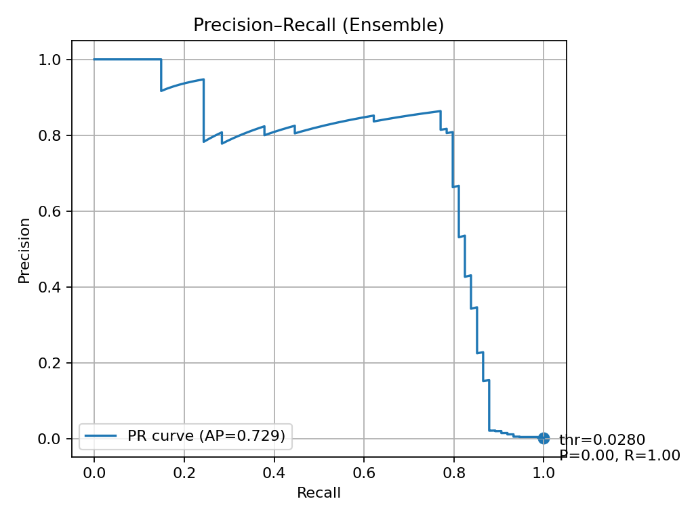
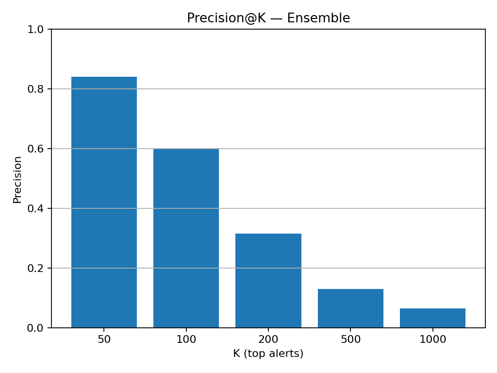

# Real-Time Fraud Detection (Semi-Supervised: Autoencoder + PU Learning)

**Goal:** Detect rare credit-card fraud in real time using semi-supervised learning.  
**Approach:** Combine an **Autoencoder** (unsupervised anomaly detection) with **Positive–Unlabeled (PU) learning**, then fuse their scores into an **ensemble** to maximize **PR-AUC** and **Precision@K**.

-------------------------------------------------------------------------------

## Results (Kaggle Credit Card Dataset)
- **PR-AUC (Ensemble):** 0.729
- **ROC-AUC (Ensemble):** 0.965
- **Precision@50:** 0.84 → 42 out of 50 top alerts are real fraud
- **Precision@100:** 0.60  
- **Suggested Threshold (~90% recall):** 0.028




-------------------------------------------------------------------------------

## Project Structure
```text
fraud-ssl/
│
├─ data/                 # local CSVs (ignored by git)
│  └─ raw/
│     └─ creditcard.csv
├─ models/               # saved model runs (ignored by git)
├─ reports/              # PR curve, Precision@K images
├─ src/                  # training, evaluation, utilities
│  ├─ train.py
│  ├─ evaluate.py
│  ├─ dump_scores.py
│  ├─ plot_pr.py
│  ├─ plot_precatk.py
│  ├─ autoencoder.py
│  ├─ pu_learning.py
│  ├─ active_learning.py
│  └─ stream.py
├─ app.py                # Streamlit dashboard
├─ requirements.txt
└─ README.md
```

## Quickstart

```powershell
Setup environment
create venv
py -3.11 -m venv .venv
.\.venv\Scripts\Activate.ps1

Install dependencies
pip install --upgrade pip
pip install -r requirements.txt

Dataset
This project uses the [Credit Card Fraud Detection dataset](https://www.kaggle.com/datasets/mlg-ulb/creditcardfraud) (Kaggle).  
- Download `creditcard.csv` and place it under `data/raw/`.  
- Note: The dataset is large and excluded from this repo via `.gitignore`.

Train the environment
-put creditcard.csv in data/raw/
py -3.11 src/train.py --data data/raw/creditcard.csv --target Class --id Time
py -3.11 src/evaluate.py --run_dir models\run_YYYYMMDD_HHMM

Visualise Metrics
py -3.11 src/dump_scores.py --run_dir models\run_YYYYMMDD_HHMM --data data/raw/creditcard.csv --target Class --id Time
py -3.11 src/plot_pr.py --scores_csv models\run_YYYYMMDD_HHMM\scores_test.csv --out reports\pr_ens.png --thr 0.028
py -3.11 src/plot_precatk.py --scores_csv models\run_YYYYMMDD_HHMM\scores_test.csv --out reports\precision_at_k.png

Running the interactive Dashboard:
py -3.11 -m streamlit run app.py

